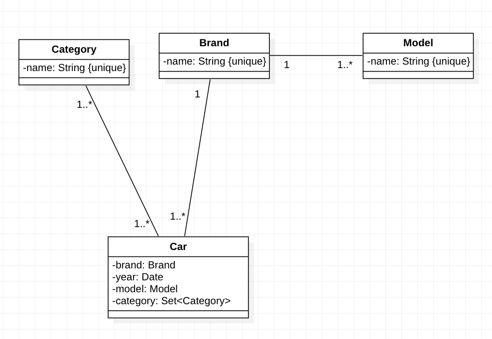

# GARAGE REST SERVICE

## ***No authorized users :***

### Given user

- User can `GET:/api/v1/cars` get page with cars.
- User can `GET:/api/v1/cars/{id}` get car.
- User can `GET:/api/v1/models` get page with models.
- User can `GET:/api/v1/models/{id}` get model.
- User can `GET:/api/v1/brands` get page with brands.
- User can `GET:/api/v1/brands/{id}` get brand.
- User can `GET:/api/v1/categories` get page with categories.
- User can `GET:/api/v1/categories/{id}` get categories.

## ***Authorized users :***

### Given user 

- User can `POST:/api/v1/cars` create car.
- User can `DELETE:/api/v1/cars/{id}` delete car.
- User can `PATCH:/api/v1/cars/{id}` update car.
- User can `POST:/api/v1/models` create model.
- User can `DELETE:/api/v1/models/{id}` delete model.
- User can `PATCH:/api/v1/models/{id}` update model.
- User can `POST:/api/v1/brands` create brand.
- User can `DELETE:/api/v1/brands/{id}` delete brand.
- User can `PATCH:/api/v1/brands/{id}` update brand.
- User can `POST:/api/v1/categories` create category.
- User can `DELETE:/api/v1/categories/{id}` delete category.
- User can `PATCH:/api/v1/categories/{id}` update category.

# Class diagram of Garage REST service

# How to run application:

## 1 variant:

1. Copy project on your device.
2. Open terminal in docker folder.
3. Enter in terminal `docker-compose up -d` - we start app db.
4. Run application.
5. Application ready to use on localhost:8080

## 2 variant:

1. Copy project on your device.
2. Run mvn package.
3. Open terminal in project folder.
4. Run `docker-compose --env-file docker/.my-env up -d` command.
5. Application ready to use on localhost:8080

## Get oAuth token:
1. Run Postman
2. Chose Authorization tab
3. Chose type oAuth 2.0
4. Enter configuration options
   1. Access Token URL: https://dev-05hip5wkey2dtyek.us.auth0.com/oauth/token
   2. Client ID: FGO77RdyJIcZmq5vhusvTBMI5rxLGF75
   3. Client Secret: YH-NuaZOIKMES5ec-DlBaOPQuELA2xi3lNtq15mSG06mwiyeEG0XKwpl4CXEcFlk
   4. Client Authentication: chose send as Basic Auth header
5. Enter advanced options
   1. Audience: https://garage-api-endpoint

